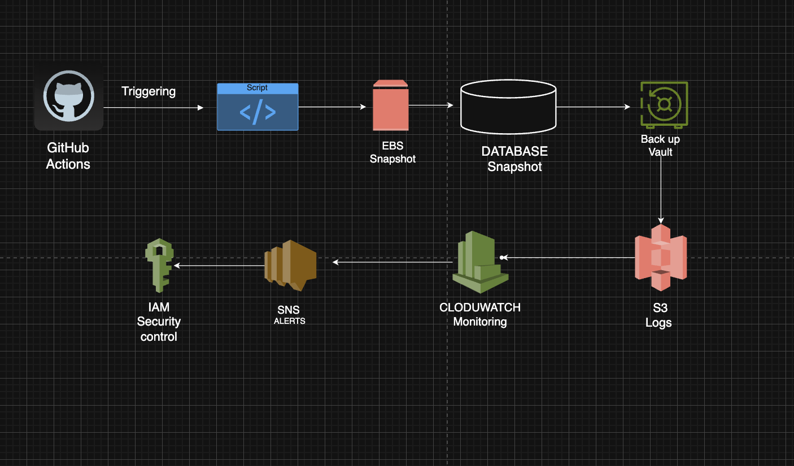

️ AWS Backup Automation & Recovery System

Project Overview

This project is an automated backup and recovery system built using AWS services and Python.  
It ensures that critical cloud resources such as EC2 instances, EBS volumes, and databases are automatically backed up on a scheduled basis, reducing the risk of data loss and manual errors.

Problem Statement

In many cloud environments:
- Backups are performed manually, risk of data loss
due to human erro,noo centralized backup strategy.
No monitoring or alerting system

This project solves these issues by fully automating
the backup lifecycle.

AWS Services Used

- AWS EC2 (Compute instances)
- AWS EBS (Volume snapshots)
- AWS RDS (Database backups)
- AWS Backup (Centralized backup management)
- AWS CloudWatch (Scheduling & monitoring)
- AWS SNS (Alerts & notifications)
- IAM (Access control & permissions)

What it does?

- Automated EC2 backup (snapshot creation)
- EBS volume backup automation.
- RDS database snapshot automation.
- Scheduled backup execution.
- Retention policy for old backups.
- Email/SNS alert on success or failure.
- Fully script-driven automation using python.

How it works?
1. Python script connects to AWS using boto3.  
2. Identifies EC2 / EBS / RDS resources.  
3. Creates snapshots automatically.  
4. Stores metadata and logs
5. Sends notification via SNS.  
6. Deletes old backups based on retention policy.

Install dependencies 
run : pip install boto3

Configure AWS credentials
run: aws configure

run backup script
python scripts/backup_ec2.py

## 🏗️ AWS Architecture Diagram

